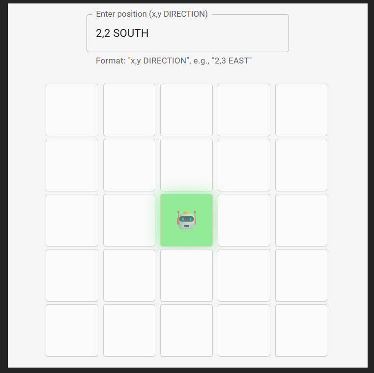
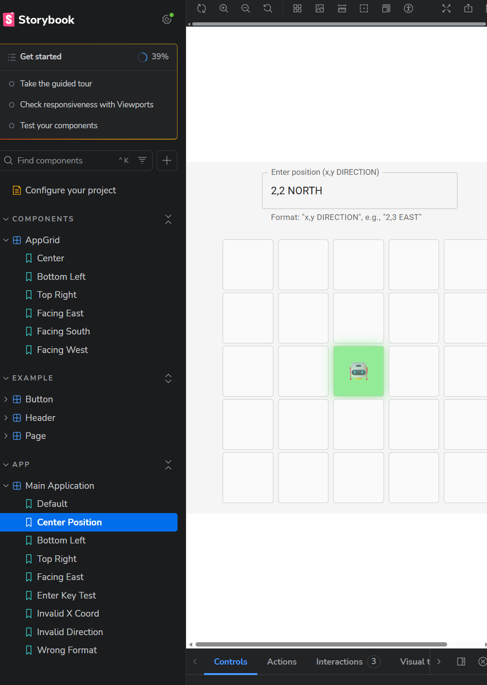

# Robot Grid Application

A React application that visualizes a robot on a 5x5 grid with position and direction controls.

## Screenshots

### Main Application


### Storybook Documentation


## Features
- 5x5 grid visualization using Material-UI
- Robot positioning with input format: "x,y DIRECTION" (e.g., "2,3 NORTH")
- Visual direction indicators with smooth rotation animation
- Input validation with error handling via Snackbar
- Storybook component documentation
- Coordinate system: (0,0) at bottom-left (South West)

## Technologies Used
- React with TypeScript
- Vite
- Material-UI (MUI)
- Storybook

## Installation
```bash
npm install
```

## Running the Application
```bash
npm run dev
```

Open [http://localhost:5173](http://localhost:5173) in your browser.

## Running Storybook
```bash
npm run storybook
```

## Project Structure
```
src/
├── components/
│   ├── AppGrid.tsx
│   └── AppGrid.stories.tsx
├── helpers/
│   └── AppHelper.ts
├── types/
│   ├── direction.ts
│   └── grid.ts
├── constants/
│   └── constants.ts
├── App.tsx
└── App.stories.tsx
```

## Input Format
- Format: `x,y DIRECTION`
- x: integer between 0-4
- y: integer between 0-4  
- DIRECTION: NORTH, EAST, SOUTH, or WEST
- Example: `2,3 EAST`

---

# React + TypeScript + Vite

This template provides a minimal setup to get React working in Vite with HMR and some ESLint rules.

Currently, two official plugins are available:

- [@vitejs/plugin-react](https://github.com/vitejs/vite-plugin-react/blob/main/packages/plugin-react) uses [Babel](https://babeljs.io/) (or [oxc](https://oxc.rs) when used in [rolldown-vite](https://vite.dev/guide/rolldown)) for Fast Refresh
- [@vitejs/plugin-react-swc](https://github.com/vitejs/vite-plugin-react/blob/main/packages/plugin-react-swc) uses [SWC](https://swc.rs/) for Fast Refresh

## React Compiler

The React Compiler is not enabled on this template because of its impact on dev & build performances. To add it, see [this documentation](https://react.dev/learn/react-compiler/installation).

## Expanding the ESLint configuration

If you are developing a production application, we recommend updating the configuration to enable type-aware lint rules:
```js
export default defineConfig([
  globalIgnores(["dist"]),
  {
    files: ["**/*.{ts,tsx}"],
    extends: [
      // Other configs...

      // Remove tseslint.configs.recommended and replace with this
      tseslint.configs.recommendedTypeChecked,
      // Alternatively, use this for stricter rules
      tseslint.configs.strictTypeChecked,
      // Optionally, add this for stylistic rules
      tseslint.configs.stylisticTypeChecked,

      // Other configs...
    ],
    languageOptions: {
      parserOptions: {
        project: ["./tsconfig.node.json", "./tsconfig.app.json"],
        tsconfigRootDir: import.meta.dirname,
      },
      // other options...
    },
  },
]);
```

You can also install [eslint-plugin-react-x](https://github.com/Rel1cx/eslint-react/tree/main/packages/plugins/eslint-plugin-react-x) and [eslint-plugin-react-dom](https://github.com/Rel1cx/eslint-react/tree/main/packages/plugins/eslint-plugin-react-dom) for React-specific lint rules:
```js
// eslint.config.js
import reactX from "eslint-plugin-react-x";
import reactDom from "eslint-plugin-react-dom";

export default defineConfig([
  globalIgnores(["dist"]),
  {
    files: ["**/*.{ts,tsx}"],
    extends: [
      // Other configs...
      // Enable lint rules for React
      reactX.configs["recommended-typescript"],
      // Enable lint rules for React DOM
      reactDom.configs.recommended,
    ],
    languageOptions: {
      parserOptions: {
        project: ["./tsconfig.node.json", "./tsconfig.app.json"],
        tsconfigRootDir: import.meta.dirname,
      },
      // other options...
    },
  },
]);
```